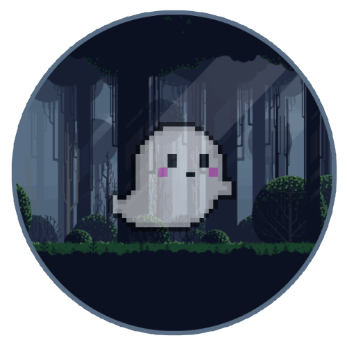

  
<h1 align="center">Zeitgeist</h1>

   A free, open-source Focus Timer to help you be present and focus on what is more important

    
    
    
    

  

## Features

* Focus Timer up to 120 Minutes
* earn points while you focus
* spend points on new backgrounds or new characters
* review your spend time

## Put down your phone and focus on what is more important

|  |  |  |
| ------------------------------------------------------------ | ------------------------------------------------------------ | ------------------------------------------------------------ |
| If you start to focus, send your  Character on a Quest  | The time you will focus your Character will pursue his Quest | The Quest will be failed  if you leave the App          |

## Desktop Client

Zeitgeist also offers a highly experimental Desktop Client. There are some issues tied to the Flutter Desktop Experience that makes further development really hard. A official Desktop Client will be released once the Problems are figured out by the Flutter team. However if you want to run and build it yourself check the [Documentation](https://github.com/daehruoydeef/Zeitgeist/wiki).